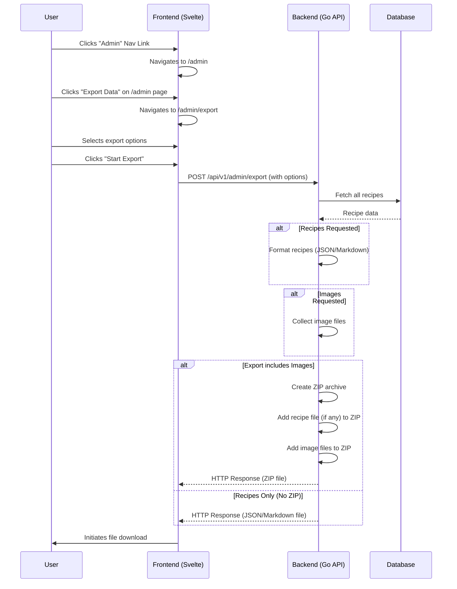

# Plan: Admin Section & Recipe/Image Export Feature

**Last Updated:** 16/05/2025

**Status:** Approved

## 1. Overall Goal

Create a dedicated "Admin" area in the web application. The first feature within this section will be an export tool allowing an administrator to export recipes (as Markdown or JSON) and optionally their associated images.

## 2. User Interface (Frontend - Svelte)

*   **Navigation Bar Update (`frontend/src/routes/+layout.svelte`):**
    *   Add a new link/button labeled "Admin" to the top navigation bar.
    *   This link will navigate to a new route, e.g., `/admin`.

*   **Admin Home Page (New Route: `/admin` - `frontend/src/routes/admin/+page.svelte`):**
    *   Serves as a dashboard for admin tasks.
    *   Initially, lists "Export Data" as an available task.
    *   Clicking "Export Data" navigates to `/admin/export`.

*   **Export Data Page (New Route: `/admin/export` - `frontend/src/routes/admin/export/+page.svelte`):**
    *   Provides export options:
        *   **Content to Export (Checkboxes/Radio Buttons):**
            *   [ ] Recipes
            *   [ ] Images
        *   **Recipe Export Format (Radio Buttons - visible if "Recipes" is checked):**
            *   ( ) Markdown
            *   ( ) JSON
        *   **Action Button:** "Start Export"

## 3. Backend Functionality (Go - Gin)

*   **New Export Endpoint (`POST /api/v1/admin/export`):**
    *   Located in `backend/internal/router/router.go` and `backend/internal/handlers/recipes.go`.
    *   Request body specifies parameters:
        ```json
        {
          "export_recipes": true,
          "export_images": true,
          "recipe_format": "markdown" // "markdown" or "json"
        }
        ```
    *   The backend generates a downloadable response (ZIP for combined/images, single file for recipes only).

*   **Export Logic (`ExportData` Handler in `backend/internal/handlers/recipes.go`):**
    1.  **Fetch All Recipes:** From the database.
    2.  **Recipe Export (if requested):**
        *   **JSON Format:** Serialize `models.Recipe` structs into a JSON array.
        *   **Markdown Format:** For each recipe, create a Markdown string including name, ingredients, method, and photo path/filename. Concatenate all recipe Markdowns.
    3.  **Image Export (if requested):**
        *   Identify unique image filenames from `PhotoFilename`.
        *   Locate images in `uploads/images/`.
    4.  **Packaging the Export:**
        *   **Recipes Only (JSON/Markdown):** Set `Content-Disposition` and `Content-Type` headers. Write file content to HTTP response.
        *   **Images Only:** Create a ZIP archive, add images, set headers, stream ZIP.
        *   **Recipes and Images:** Create a ZIP, add recipe file (JSON/MD) and images, stream ZIP.

## 4. Data Structures & Formatting Details

*   **Recipe JSON:** Array of `models.Recipe` structs.
*   **Recipe Markdown:**
    *   One large file or individual files within a ZIP.
    *   Image paths in Markdown to be relative if zipped.
    *   Example structure per recipe:
        ```markdown
        # Recipe Name

        ## Ingredients
        - Full Ingredient 1
        - Full Ingredient 2

        ## Method
        Method steps...

        ## Photo
        
        ```

## 5. Workflow Diagram (High-Level)



## 6. Iterative Implementation Plan

*   **Step 1: Backend - Basic Recipe Export (JSON).**
    *   Create `/api/v1/admin/export` endpoint.
    *   Implement logic for JSON recipe export as a downloadable file.
*   **Step 2: Frontend - Basic Admin UI & JSON Export Trigger.**
    *   Add "Admin" link to layout.
    *   Create `/admin` and `/admin/export` pages.
    *   Simple button on `/admin/export` to trigger JSON recipe export.
*   **Step 3: Backend - Add Markdown Recipe Export.**
*   **Step 4: Backend - Add Image Export (as ZIP).**
*   **Step 5: Backend - Combine Recipe & Image Export (into a single ZIP).**
*   **Step 6: Frontend - Full Export Options UI.**

## 7. Security Considerations (Future)
*   The `/api/v1/admin/export` endpoint and any other admin functionalities should be protected via authentication/authorization in a production environment.