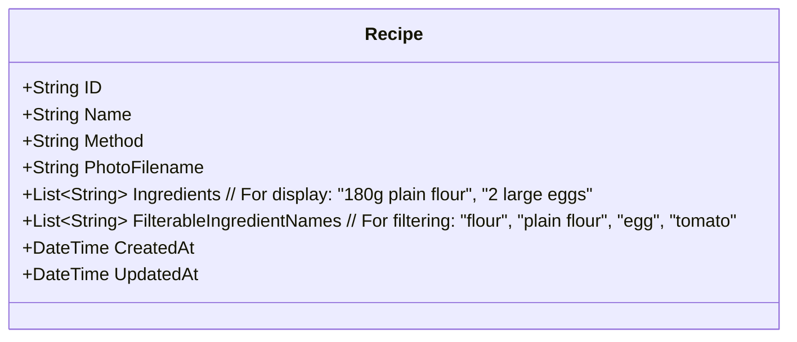

# Plan to Improve Ingredient Filtering

**Last Updated:** 16/05/2025

**Status:** Approved

## 1. Problem Statement

Currently, ingredients in recipes are stored as full, descriptive strings (e.g., "180g plain flour", "2 large eggs", "1 pinch of salt"). While this is good for displaying recipe details accurately, it makes effective filtering by core ingredient names (e.g., "flour", "egg", "salt") very difficult. Users expect to be able to type a simple ingredient name and find all relevant recipes, but the current system requires an exact match on the full descriptive string.

## 2. Goal

Enable users to filter recipes by the main, core ingredient name (e.g., "flour", "tomato") while still displaying the full, descriptive ingredient string (e.g., "180g plain flour", "2 large eggs") on the recipe details page and during recipe entry.

## 3. Proposed Solution (Iterative Approach)

The solution will be implemented in phases:

### Phase 1: Backend Modifications

#### 3.1. Update Data Model (`backend/internal/models/recipe.go`)

*   Introduce a new field to the `Recipe` struct specifically for filtering:
    *   `FilterableIngredientNames []string`
*   The existing `Ingredients []string` field will remain. It will continue to store the full ingredient strings as entered by the user, used for displaying the recipe details accurately.
*   The new `FilterableIngredientNames` field will store a list of extracted, normalized (lowercase, trimmed) core ingredient names.

**Visualized Data Model:**

#### 3.2. Enhance Ingredient Parsing Logic (in `CreateRecipe` and `UpdateRecipe` handlers in `backend/internal/handlers/recipes.go`)

*   When a recipe is created or updated, the backend receives the `ingredientsStr` (comma-separated list of full ingredient strings).
*   For each full ingredient string:
    *   It will still be added to the `recipe.Ingredients` slice as is (for display).
    *   A new parsing function/heuristic will be implemented to extract core, filterable name(s).
        *   **Initial Parsing Heuristic Idea:**
            1.  Convert the full ingredient string to lowercase.
            2.  Attempt to remove common quantities (numbers like "1", "2.5", "1/2").
            3.  Attempt to remove common units (e.g., "g", "kg", "ml", "l", "oz", "lb", "tsp", "tbsp", "cup", "cups", "pinch", "cloves").
            4.  Attempt to remove common descriptive/preparation adjectives (e.g., "fresh", "dried", "chopped", "diced", "large", "small", "medium", "ripe", "minced", "plain", "self-raising", "whole", "ground").
            5.  The remaining significant words would be considered the filterable name(s). For "180g plain flour", this might yield "plain flour" and "flour". For "2 large eggs", it might yield "eggs".
            6.  Consider splitting the remaining string into individual words and adding them if they are not common stop words (e.g., "of", "a", "the", "and").
            7.  Trim whitespace from each extracted name.
    *   These extracted and normalized (lowercase, trimmed) names will be added to the `recipe.FilterableIngredientNames` slice. Duplicates within this list for a single recipe should be avoided.

#### 3.3. Modify Filtering Logic (`containsAnyTag` function in `backend/internal/handlers/recipes.go`)

*   This function will be updated to compare the user's `filterTags` (e.g., "tomato") against the new `recipe.FilterableIngredientNames` slice instead of the full `recipe.Ingredients` slice.

### Phase 2: Data Migration for Existing Recipes

*   A one-time migration process will be required to update existing recipes in the database:
    *   Iterate through all existing recipes.
    *   For each recipe, apply the new ingredient parsing heuristic (from Phase 1, Step 3.2) to its current `Ingredients` list.
    *   Populate the new `FilterableIngredientNames` field with the extracted names.
    *   Save the updated recipe back to the database.
    *   This can be implemented as a separate utility script or a function that can be triggered (e.g., via a CLI command or an admin endpoint) or run once on application startup post-deployment.

### Phase 3: Frontend (Minimal Immediate Changes Anticipated)

*   **Filtering Input:** Users should continue to be able to type simple ingredient names like "flour" or "tomato" into the filter box. The backend will handle the improved matching.
*   **Recipe Display:** The recipe detail pages will continue to display the full, descriptive ingredient strings from the `recipe.Ingredients` field.

## 4. Key Challenges & Considerations

*   **Ingredient Parsing Robustness:** The effectiveness of the ingredient parsing heuristic is critical. Natural language in recipes is diverse. The initial heuristic will be an approximation and will likely need ongoing refinement. The goal is significant improvement, not perfection.
*   **Data Migration:** This process must be designed and tested carefully to ensure data integrity.
*   **Performance:** Complex parsing rules could slightly impact performance during recipe creation/update, though this should be manageable with a reasonable heuristic.
*   **List of Units/Descriptors:** Maintaining the lists of units and descriptors for the parsing heuristic will be important.

## 5. Future Enhancements (Beyond this immediate fix)

*   Introduce a more structured ingredient input form on the frontend (e.g., separate fields for quantity, unit, name, preparation notes).
*   Integrate a more sophisticated third-party ingredient parsing library or NLP techniques.
*   Allow users to manually review and adjust the auto-extracted filterable ingredient names for their recipes.
*   Consider stemming for ingredient names (e.g., "tomato" and "tomatoes" treated as the same).