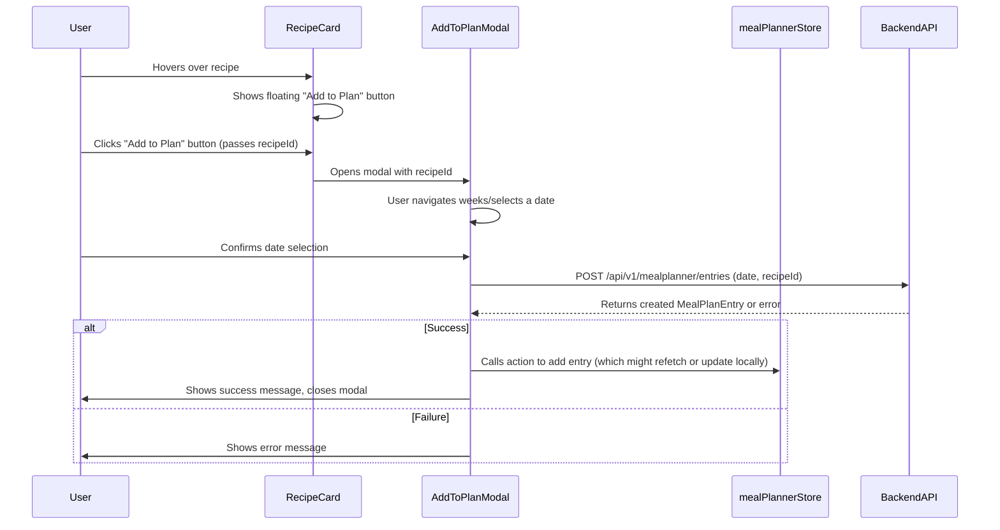
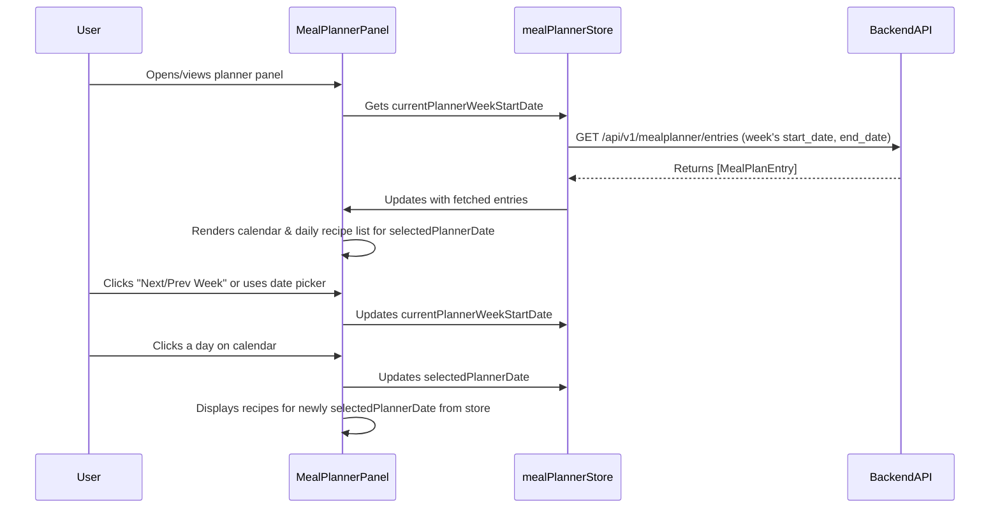

# Plan: Weekly Meal Planner Feature

**Last Updated:** 19/05/2025

**Status:** Approved

## 1. Overall Goal

To implement a weekly meal planner allowing users to assign recipes to specific days. The planner will be displayed in a collapsible panel on the main recipe listing page, and users can add recipes to it via a floating button on recipe cards/items.

## 2. Key Decisions & Behaviors

*   **Data Storage:** Meal plan data will be stored in the backend database (BadgerDB).
*   **Planning Horizon:** Users can plan indefinitely into the future.
*   **Navigation:**
    *   The main planner panel will have "Previous Week" and "Next Week" buttons.
    *   A date picker will allow jumping to a specific week.
*   **Adding Recipes to Plan:**
    *   A floating button appears on recipe hover (e.g., on recipe cards).
    *   Clicking this button opens a small modal/popover.
    *   This modal shows a mini-calendar (defaulting to the current week) for day selection.
    *   The mini-calendar in the modal also has "Previous Week" / "Next Week" navigation.
*   **Displaying Planned Meals:**
    *   The main planner panel (collapsible, on the right of the recipe list page) shows a calendar for the selected week.
    *   Days in the calendar with planned recipes will be visually distinct (e.g., different background color).
    *   Clicking a day in the calendar (or by default, the currently selected day) displays the list of recipes planned for that day below the calendar.
    *   Multiple recipes per day are allowed and displayed in the order they were added.
*   **Interacting with Planned Meals (in the panel):**
    *   Users can remove a recipe from a planned day.
    *   Clicking a recipe's name in the planned list navigates to its full detail page.

## 3. Data Model (Backend - `models.MealPlanEntry`)

A new model will be needed:

```go
package models

import "time"

// MealPlanEntry represents a single recipe planned for a specific date.
// Since multiple recipes can be on one day, each recipe assignment is an entry.
type MealPlanEntry struct {
	ID        string    `json:"id"` // Unique ID for this meal plan entry (e.g., UUID)
	Date      time.Time `json:"date"` // The specific date (YYYY-MM-DD), time part normalized to UTC midnight
	RecipeID  string    `json:"recipe_id"`
	CreatedAt time.Time `json:"created_at"`
	// UserID    string    `json:"user_id"` // If multi-user support is added later
}
```
*   The `Date` field will store the specific day (normalized to YYYY-MM-DD 00:00:00 UTC).
*   The `ID` will be a UUID generated by the backend upon creation.

## 4. Backend API Endpoints

*   **`POST /api/v1/mealplanner/entries`**: Add a recipe to a specific date.
    *   Request body: `{ "date": "YYYY-MM-DD", "recipe_id": "string" }`
    *   Response: The created `models.MealPlanEntry` (HTTP 201).
*   **`GET /api/v1/mealplanner/entries`**: Fetch planned meals for a date range.
    *   Query parameters: `start_date=YYYY-MM-DD`, `end_date=YYYY-MM-DD`.
    *   Response: `[]models.MealPlanEntry` (HTTP 200). The frontend will be responsible for fetching recipe details separately if needed, or this endpoint could be expanded later to include them. For V1, just the entries.
*   **`DELETE /api/v1/mealplanner/entries/:entry_id`**: Remove a specific recipe (meal plan entry) from a planned day.
    *   Response: Success status (HTTP 204 No Content).

## 5. Backend Logic (New handlers in `backend/internal/handlers/mealplanner_handlers.go`)

*   **`CreateMealPlanEntryHandler`:**
    *   Parse and validate input (`date` string, `recipe_id` string).
    *   Convert `date` string to `time.Time`, normalizing to UTC midnight.
    *   Ensure `RecipeID` refers to an existing recipe (optional check, could rely on foreign key constraints if SQL, or an explicit DB check).
    *   Create a new `models.MealPlanEntry` with a new UUID for `ID`, the normalized date, `RecipeID`, and `CreatedAt`.
    *   Save to database using `database.SaveMealPlanEntry`.
    *   Return the created entry.
*   **`ListMealPlanEntriesHandler`:**
    *   Parse and validate `start_date` and `end_date` query parameters. Convert to `time.Time`.
    *   Fetch entries from `database.GetMealPlanEntriesByDateRange`.
    *   Return the list of entries.
*   **`DeleteMealPlanEntryHandler`:**
    *   Get `entry_id` from path parameter.
    *   Call `database.DeleteMealPlanEntry(entry_id)`.
    *   Return appropriate success/error status.

## 6. Database Logic (New functions in `backend/internal/database/badgerdb.go`)

*   **`MealPlanEntryKeyPrefix = "mealplanentry:"`**
*   **`mealPlanEntryKey(entryID string) []byte`**
*   **`SaveMealPlanEntry(entry *models.MealPlanEntry) error`**: Saves the entry, marshalled to JSON, using `entry.ID` for the key.
*   **`GetMealPlanEntriesByDateRange(startDate, endDate time.Time) ([]models.MealPlanEntry, error)`**:
    *   This is more complex with BadgerDB as it doesn't have secondary indexes easily.
    *   Option 1 (Simpler for V1, less performant for huge datasets): Iterate over all meal plan entries, unmarshal, and check if `Date` falls within the range.
    *   Option 2 (More complex): Store entries with keys that allow date range scans, e.g., `mealplanentry:date:{YYYY-MM-DD}:{entry_id}`. This requires careful key design. For V1, Option 1 might be acceptable if the number of total entries isn't enormous.
*   **`DeleteMealPlanEntry(entryID string) error`**: Deletes the entry by its ID.
*   **`RecipeExists(recipeID string) (bool, error)`**: (Already exists) - can be used by `CreateMealPlanEntryHandler` for validation.

## 7. Frontend UI (Svelte)

*   **Main Page (`frontend/src/routes/+page.svelte`):**
    *   Integrate a new collapsible right panel component: `MealPlannerPanel.svelte`.
*   **`MealPlannerPanel.svelte` (New Component):**
    *   Manages the display of the weekly calendar and daily meal lists.
    *   Contains:
        *   Calendar display (e.g., a 7-day row).
        *   "Previous Week" / "Next Week" buttons.
        *   Date picker input (e.g., `<input type="date">` styled to pick a week or jump).
        *   Area below calendar to list recipes for the selected day.
    *   Fetches meal plan entries for the displayed week from the backend.
    *   Allows selecting a day to view its meals.
    *   Highlights days in the calendar that have one or more meals planned.
    *   Handles removal of meals (calling DELETE API).
*   **Recipe Card / Item Component (e.g., `frontend/src/lib/components/RecipeCard.svelte`):**
    *   Add a floating button (e.g., `+📅`) visible on hover.
    *   Clicking this button opens the `AddToPlanModal.svelte` component, passing the `recipeId`.
*   **`AddToPlanModal.svelte` (New Component):**
    *   Receives `recipeId` as a prop.
    *   Displays a mini-calendar (7-day view).
    *   "Previous Week" / "Next Week" buttons for this mini-calendar.
    *   Allows user to select a date.
    *   On date selection, makes a `POST` request to `/api/v1/mealplanner/entries`.
    *   Shows success/error feedback. Closes on success and triggers a refresh of the main `MealPlannerPanel`.
*   **State Management (Svelte Stores - e.g., `frontend/src/lib/stores/mealPlannerStore.ts`):**
    *   `currentPlannerWeekStartDate`: A `Date` object representing the start of the week being viewed in the main planner.
    *   `plannedMealsForWeek`: An object or Map storing `MealPlanEntry[]` keyed by date string for the `currentPlannerWeekStartDate`.
    *   `selectedPlannerDate`: A `Date` object for the day whose meals are being listed.
    *   Functions to fetch, add, and remove meal plan entries, interacting with the API and updating stores.

## 8. Workflow Diagrams

**Adding a Recipe to Plan:**


**Viewing Meal Plan & Navigation:**


## 9. Potential Improvements/Future Considerations (Post V1)

*   Drag and Drop functionality.
*   Meal Types (Breakfast, Lunch, Dinner).
*   Shopping List Generation.
*   User Accounts & Sharing.
*   Performance optimization for `GetMealPlanEntriesByDateRange` if dataset grows large (e.g., more complex keying).
*   Editing a planned entry (e.g., changing its date).